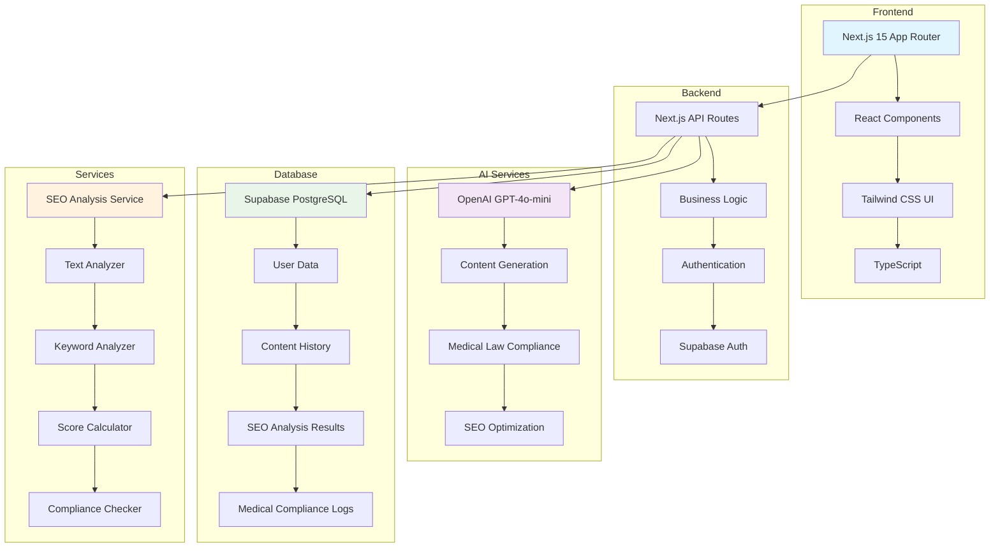
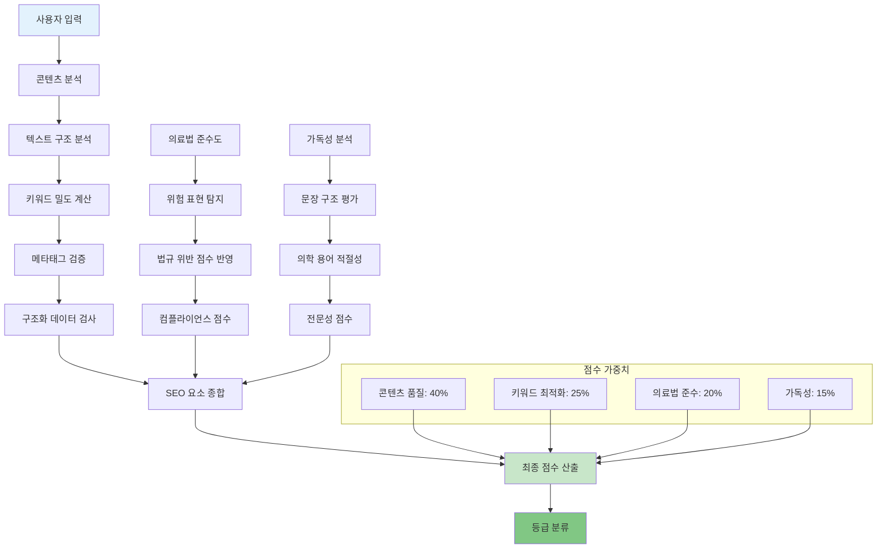
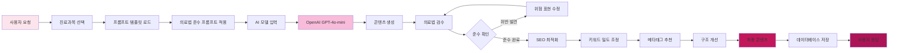
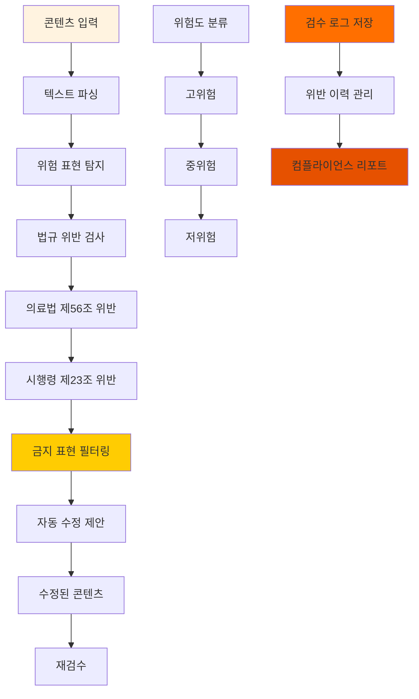
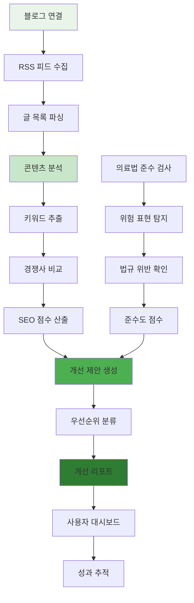
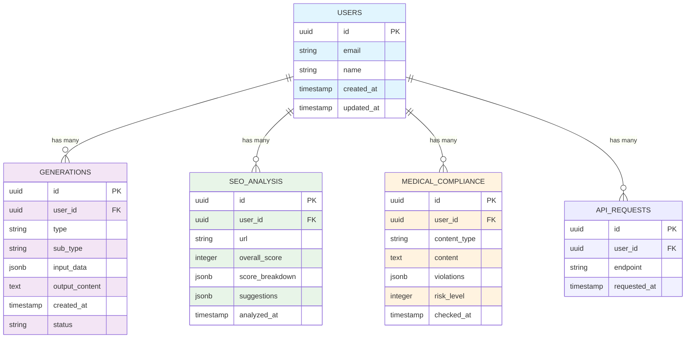

* 다음 내용을 반드시 포함하여 상세하게 작성할 것, 필요시 업체양식으로 작성 가능

1. 계약(개발)명 : 

메디웨이즈고도화 및 쇼츠 생성 AI 기능 추가 개발

2. 계약(개발) 목표 : 

메디웨이즈 플랫폼의 고도화를 통한 의료 콘텐츠 생성 AI 기능 향상 및 블로그 글 SEO 최적화 기능 추가. SEO 최적화 대시보드, 의료광고법 준수 자동 검수 시스템, 그리고 블로그 글 SEO 점수 산출 및 개선 기능 구현.

3. 계약(개발) 내용 : 

주요 기능
SEO 점수 산출 및 대시보드 시스템 구축
진료 과목별 맞춤형 콘텐츠 생성 AI 고도화
의료광고법 준수 자동 검수 및 컴플라이언스 시스템
블로그 글 SEO 최적화 및 점수 산출 기능
텍스트 파싱을 통한 콘텐츠 사후 검수 시스템

4. 개발내용별 작업내용
SEO 대시보드 개발

SEO 점수 산출 시스템 구축
세부내역:
콘텐츠별 SEO 점수 분석 알고리즘 개발
키워드 밀도, 메타태그, 구조화 데이터 분석 엔진
실시간 SEO 점수 계산 및 업데이트 시스템
검색엔진 최적화 요소별 가중치 적용 로직

SEO 대시보드 기능 개발
세부내역:
직관적인 SEO 성과 시각화 대시보드
SEO 개선 제안사항 자동 생성 기능
경쟁사 대비 SEO 성과 비교 분석
SEO 트렌드 모니터링 및 알림 시스템

콘텐츠 생성 기능 고도화

각 콘텐츠별 진료 과목 추가
세부내역:
30개 이상 진료과별 전문 콘텐츠 템플릿 개발
과목별 의료 용어 및 특성 데이터베이스 구축
진료과별 콘텐츠 톤앤매너 차별화 시스템
전문성 검증을 위한 의료진 감수 워크플로우

데이터 학습 및 프롬프트 개선
세부내역:
의료 분야 특화 학습 데이터 수집 및 정제
진료과별 최적화된 프롬프트 엔지니어링
A/B 테스트 기반 프롬프트 성능 최적화
사용자 피드백 반영 자동 학습 시스템

의료광고법 준수 기능 고도화

생성된 콘텐츠의 사후 검수 컴플라이언스 시스템
세부내역:
의료광고법 위반 요소 자동 탐지 알고리즘
실시간 컴플라이언스 검증 및 경고 시스템
위반 사항별 위험도 등급 분류 기능
법규 변경사항 자동 업데이트 및 적용

텍스트 파싱을 통한 콘텐츠 검수 기능
세부내역:
자연어 처리(NLP) 기반 텍스트 분석 엔진
금지 표현 및 필수 포함 사항 자동 검출
콘텐츠 적합성 점수 산출 시스템
수정 가이드라인 및 대체 표현 제안 기능

블로그 글 SEO 점수 기능 개발

기존 블로그 글 SEO 점수 산출
세부내역:
기존 블로그 포스트 SEO 성과 분석 시스템
키워드 순위, 클릭률, 노출수 등 종합 점수 산출
경쟁사 대비 SEO 성과 벤치마킹 기능
과거 SEO 성과 트렌드 분석 및 시각화

SEO 개선 기능
세부내역:
SEO 점수 기반 콘텐츠 개선 제안 시스템
메타 제목, 설명, 헤더 구조 최적화 도구
내부 링크 구조 분석 및 개선 제안
이미지 ALT 태그, 구조화 데이터 자동 생성
콘텐츠 길이, 가독성 점수 개선 가이드

5. 결과물 (Output, Spec)

SEO 대시보드 시스템

완성된 SEO 분석 플랫폼: 실시간 SEO 점수 조회 및 상세 분석 리포트
SEO 개선 도구: 자동 최적화 제안 및 실행 가이드
경쟁 분석 기능: 동종업계 SEO 성과 벤치마킹 도구
통계 대시보드: SEO 성과 트렌드 및 ROI 분석

고도화된 콘텐츠 생성 시스템

진료과별 특화 콘텐츠 생성기: 30개 이상 진료과 맞춤형 콘텐츠 생성 지원
개선된 AI 모델: 의료 전문성이 강화된 콘텐츠 생성 AI
프롬프트 관리 시스템: 중앙 집중식 프롬프트 버전 관리 및 성능 모니터링
품질 평가 도구: 생성된 콘텐츠의 품질 점수 및 개선 제안

의료광고법 준수 시스템

실시간 컴플라이언스 검증기: 콘텐츠 작성 중 실시간 법규 준수 확인
자동 검수 리포트: 위반 사항 및 수정 제안 자동 생성
법규 데이터베이스: 최신 의료광고법 규정 자동 업데이트 시스템
검수 히스토리: 검수 이력 관리 및 통계 분석 기능

블로그 글 SEO 최적화 시스템

SEO 점수 산출 엔진: 기존 블로그 글의 SEO 성과 종합 분석
SEO 개선 도구: 메타태그, 헤더구조, 키워드 최적화 자동 제안
성과 추적 시스템: SEO 개선 전후 성과 비교 및 모니터링
최적화 가이드: 단계별 SEO 개선 실행 매뉴얼

통합 관리 시스템

통합 대시보드: 모든 기능의 통계 및 성과 한눈에 보기
사용자 가이드: 신규 기능별 상세 사용법 매뉴얼
API 문서: 개발자를 위한 상세 API 스펙 문서
유지보수 서비스: 기능 안정화 및 사용자 피드백 반영 서비스

6. 증빙자료

6-1. 제품 요구사항 정의서(PRD)

Mediways 고도화 - AI 의료 콘텐츠 & SEO 최적화 플랫폼

SEO 최적화된 의료 콘텐츠 자동 생성
의료광고법 100% 준수 보장 시스템
기존 블로그 글 SEO 성과 분석 및 개선
진료과별 맞춤형 콘텐츠 특화

6-2. 주요 기능 스크린샷

SEO 대시보드 메인 화면
진료과별 콘텐츠 생성 인터페이스
의료광고법 검수 결과 화면
블로그 글 SEO 점수 분석 도구
SEO 개선 제안 시스템

6-3. 시스템 아키텍처

### 1. 전체 시스템 아키텍처

### 2. SEO 점수 산출 알고리즘

### 3. 콘텐츠 생성 AI 파이프라인

### 4. 의료광고법 검수 시스템

### 5. 블로그 SEO 분석 워크플로우

### 6. 데이터베이스 스키마

6-4. 개발 결과물 샘플

진료과별 콘텐츠 생성 샘플 (10개 과목)
SEO 최적화 블로그 글 예시
SEO 점수 분석 리포트 샘플
의료광고법 검수 결과 예시

※ 시금형개발은 시금형보관증 필수 첨부

